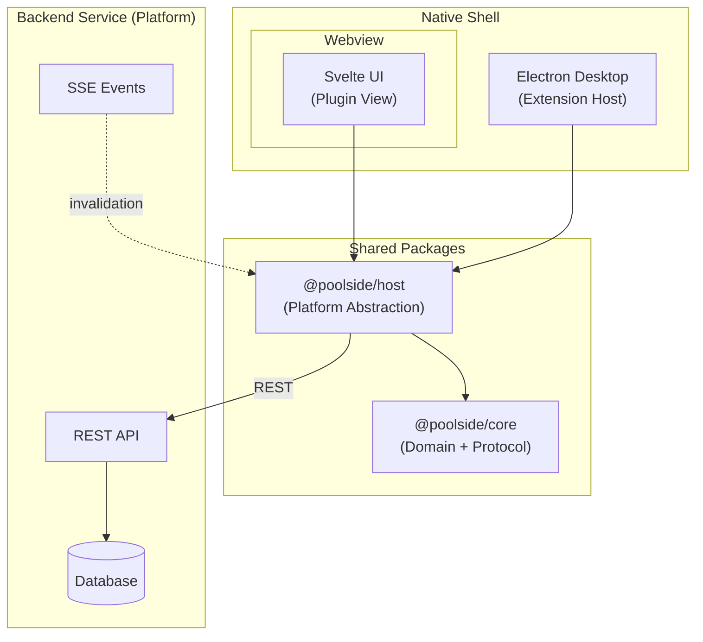
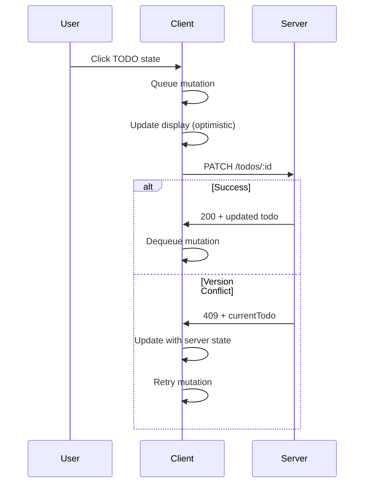

# Collaborative TODO App

A collaborative TODO list that mimics how IDE plugins are built: **Webview running inside a native shell (Electron)**, communicating with a backend service.

## Context

This project demonstrates the architecture pattern of a web UI running inside a native shell:

- **Desktop app** = Electron shell (similar to an IDE extension host)
- **Web UI** = Svelte components (similar to a plugin webview)
- **Server** = REST API + real-time sync

## Goals

- **Mimic IDE plugin architecture** - webview inside the Electron, talking to a backend
- Keep the project **small, readable, and easy to explain** in an interview
- Ship a collaboration/sync story that stays correct under:
  - Slow network conditions
  - Concurrent edits from multiple users
  - Reconnects (SSE + online/offline events)

**Non-goals:** persistence, production infrastructure, CRDTs/event sourcing.

---

## Quick Start

### Prerequisites

- Node.js 22+
- pnpm 10+

### Installation

```bash
pnpm install
```

### Running

```bash
# Start everything (server + web + packages in watch mode)
pnpm dev

# Or run individually:
pnpm dev:server    # REST API on http://localhost:3001
pnpm dev:web       # Web UI on http://localhost:5173
pnpm dev:desktop   # Electron app

# Simulate slow network (adds latency to all API requests)
SIMULATED_LATENCY_MS=2000 pnpm dev
```

### Testing

```bash
pnpm test          # Run all tests
pnpm test:server   # Server tests only
```

### Multi-User Testing

To test sync and conflict resolution with multiple users:

1. **Browser + Electron** - Open `http://localhost:5173` in a browser while running `pnpm dev:desktop`
2. **Multiple browsers** - Open the web UI in different browsers (each gets a unique user)
3. **Multiple Electron instances** - Run `pnpm dev:desktop` in separate terminals (note: they share the same user due to shared local storage, but this still works for testing sync behavior)

**Tip:** Use `SIMULATED_LATENCY_MS=2000 pnpm dev:server` to slow down API responses - this makes it easier to trigger and observe version conflicts when both users click the same todo.

---

## Architecture

### High-Level Overview

This mirrors IDE plugin architecture:



### Package Structure

```
packages/
├── core/           # Domain types, state machine, protocol helpers
└── host/           # Sync engine, platform abstraction (browser/electron)

apps/
├── server/         # Fastify REST API, in-memory store, SSE
├── web/            # Svelte 5 UI (runs in browser OR Electron)
└── desktop/        # Electron shell
```

**Design note:** The `HostPlatform` interface in `@poolside/host` is intentionally transport-level, not domain-level. This allows the same sync logic to work across different environments (Electron main, renderer, browser, worker).

### Tech Stack

| Layer    | Technology                       |
| -------- | -------------------------------- |
| Language | TypeScript 5.9 (strict mode)     |
| Frontend | Svelte 5, Vite 7, Tailwind CSS 4 |
| Backend  | Fastify 5, Node.js 22            |
| Desktop  | Electron 39                      |
| Monorepo | pnpm workspaces                  |
| Testing  | Vitest                           |

---

## Key Design Decisions

### 1. Sync Engine (Optimistic Updates)

The sync engine uses a mutation queue pattern for responsive UI:



**Key files:**

- `apps/web/src/lib/sync/processor.ts` - 4-phase mutation processor
- `apps/web/src/lib/sync/merge.ts` - Server + local merge logic
- `apps/web/src/lib/sync/state.ts` - Sync state management

### 2. State Machine

Sequential transitions only (validated on both client AND server):

```
TODO ↔ ONGOING ↔ DONE
```

You cannot jump directly from TODO to DONE.

**Key file:** `packages/core/src/todo-state-machine.ts`

### 3. Conflict Resolution

Version-based optimistic locking (compare-and-swap pattern):

```typescript
// Server: apps/server/src/store.ts
compareAndSwapTodo(todoId, expectedVersion, updates);
// Returns { success: true, todo } or { success: false, currentTodo }
```

The database implementation pattern this maps to:

```sql
UPDATE todos SET state = $1, version = version + 1
WHERE id = $2 AND version = $3  -- atomic check-and-update
RETURNING *;
```

On conflict (409), the server returns the current todo state, and the client automatically retries.

### 4. Delta Sync

Cursor-based pagination using composite key `(updatedAt, todoId)` to avoid "same timestamp" ambiguity:

- Multiple todos can update in the same millisecond
- Composite cursor ensures no records are skipped
- Server uses monotonic timestamps (`apps/server/src/utils/time.ts`)
- SSE sends "changed" events → client fetches delta via REST

**Why SSE for invalidation only?** Simpler consistency model - single source of truth is always the REST endpoint.

### 5. Store Architecture

The in-memory store (`apps/server/src/store.ts`) exposes **only async accessors/mutators**. Route handlers don't reach into Maps directly, so swapping to the real database later is straightforward.

**Intentional simplification:** The server does not persist or enforce list membership/ACLs. If a client knows a `listId` (or can join via `joinKey`), the server accepts reads/writes for that list.

### 6. HostPlatform: Transport-Level vs Domain-Level

The `HostPlatform` interface exposes **primitive I/O operations** (`fetch`, `openEventStream`, `getItem`/`setItem`) rather than domain methods (`syncTodos`, `updateTodoState`).

**Why not domain-level?** A domain-oriented approach would look like:

```typescript
// ❌ Domain-level (NOT what we do)
interface HostPlatform {
  syncTodos(listId: string, syncToken?: string): Promise<SyncTodosResponse>;
  updateTodoState(todoId: string, state: TodoState): Promise<Todo>;
  createTodo(listId: string, todo: CreateTodoRequest): Promise<Todo>;
  // ... one method per API endpoint
}
```

**Problems with domain-level:**

1. **Coupling** - Every new endpoint requires changes to platform implementations (browser, Electron, worker)
2. **Duplication** - Each platform re-implements the same request/response logic
3. **Testing** - Must mock domain methods; can't test protocol logic in isolation

**Transport-level approach:**

```typescript
// ✅ Transport-level (what we do)
interface HostPlatform {
  fetch<T>(request: HostFetchRequest): Promise<HostFetchResponse<T>>;
  openEventStream(request, handlers): Promise<CloseFunction>;
  getItem<T>(key: string): Promise<T | null>;
  setItem<T>(key: string, value: T): Promise<void>;
}
```

**Benefits:**

1. **Thin interface** - Only 5-6 methods to implement per environment
2. **Protocol logic stays in `@poolside/host`** - `ApiClient` builds requests, handles errors, retries
3. **Easy to add endpoints** - New API routes only change `ApiClient`, not platform implementations
4. **Testable** - Mock at HTTP level, test full request/response cycle
5. **Portable** - Same sync engine works in Electron main, renderer, browser, service worker

This mirrors how IDE extensions work: the extension host provides primitive I/O, and the extension (webview) builds domain logic on top.

**Key file:** `packages/core/src/host.ts`

---

## Trade-offs & Simplifications

| Decision                    | Trade-off                    | Rationale                                                    |
| --------------------------- | ---------------------------- | ------------------------------------------------------------ |
| **In-memory database**      | Data lost on server restart  | Focus on sync logic, not persistence                         |
| **TODO-specific sync**      | Not a generic sync framework | Avoid over-engineering for demo                              |
| **No real authentication**  | User IDs without passwords   | Not in requirements                                          |
| **No pagination**           | Won't scale to large lists   | Fine for demo purposes                                       |
| **JSON file storage**       | Not encrypted in Electron    | Simple local persistence                                     |
| **No delete functionality** | Can't remove todos           | Soft delete (`deletedAt`) is ready but UI not implemented    |
| **Minimal error UX**        | Some errors handled silently | MVP scope - correct state maintained, user feedback deferred |
| **macOS only**              | Windows/Linux not tested     | Development and testing done on macOS; cross-platform not verified |
| **No Electron builder**     | Can't package for distribution | Dev mode only; electron-builder/forge intentionally skipped |

---

## Future Improvements

1. **Data Persistence** - Replace in-memory store with the real database
2. **Content editing** - Support title/description changes (mutation type scaffolding exists)
3. **Conflict UX** - Add toast notification for conflicts
4. **Deletions** - `deletedAt` field exists; add deletion endpoints/UI
5. **Real authentication** - JWT or session-based auth
6. **Pagination / virtualization** - For large todo lists
7. **Offline persistence** - Persist mutation queue to survive app restarts
8. **User display names** - Currently just IDs, no names shown
9. **Todo descriptions** - Only titles exist, no body text
10. **Search/filter** - Filter by state or search by title
11. **Keyboard shortcuts** - Power user navigation
12. **Undo support** - Revert accidental state changes
13. **E2E tests** - Playwright for cross-browser testing

---

## Code Review Guide

### Recommended Order (15-20 min)

1. **Domain Model** - `packages/core/src/types.ts` (34 lines)
   - User, TodoList, Todo types
   - TodoState: `'TODO' | 'ONGOING' | 'DONE'`

2. **State Machine** - `packages/core/src/todo-state-machine.ts`
   - `isValidTransition(from, to)` - enforces sequential transitions
   - `getNextState(current)` - cycles through states

3. **Server Routes** - `apps/server/src/routes/todos.ts`
   - GET `/lists/:listId/todos` - delta sync with cursor
   - POST `/lists/:listId/todos` - create todo
   - PATCH `/todos/:todoId/state` - update with version check

4. **Store** - `apps/server/src/store.ts`
   - Async interface ready for database swap
   - `compareAndSwapTodo()` - optimistic locking
   - `isTodoAfterCursor()` - cursor filtering helper

5. **Sync Processor** - `apps/web/src/lib/sync/processor.ts`
   - 4-phase loop: CHECK → VALIDATE → EXECUTE → HANDLE
   - Has excellent ASCII documentation

6. **Merge Logic** - `apps/web/src/lib/sync/merge.ts`
   - Combines server state + pending mutations
   - Has ASCII diagram explaining the flow

### Key Concepts to Trace

#### "What happens when two users click the same TODO?"

1. Both clients send PATCH with their `expectedVersion`
2. First one succeeds, second gets 409 with `currentTodo`
3. Second client updates local state, retries with new version
4. File trace: `store.ts:compareAndSwapTodo` → `todos.ts:187-192` → `processor.ts:324-326`

#### "How does delta sync work?"

1. Client stores `syncToken` from previous response
2. Server decodes to cursor `(updatedAt, todoId)`
3. Returns only todos newer than cursor
4. File trace: `routes/todos.ts:46-69` → `store.ts:isTodoAfterCursor`

#### "Why SSE for invalidation only?"

1. SSE sends "changed" event (no data payload)
2. Client calls `syncOnce()` which fetches via REST
3. Single source of truth, no data consistency issues between protocols
4. File trace: `sse.ts:notifyListChanged` → `operations.ts:syncOnce`

### Test Files

| Area             | Test File                                      |
| ---------------- | ---------------------------------------------- |
| State machine    | `packages/core/src/todo-state-machine.test.ts` |
| Store operations | `apps/server/src/store.test.ts`                |
| API endpoints    | `apps/server/src/routes/*.test.ts`             |
| Sync engine      | `apps/web/src/lib/sync/*.test.ts`              |

---

## API Reference

### Authentication

```
POST /auth/bootstrap
Body: { userId?: string }
Response: { user: User }
```

### Lists

```
POST /lists
Body: { userId: string }
Response: { listId: string, joinKey: string }

POST /lists/join
Body: { userId: string, joinKey: string }
Response: { listId: string, list: TodoList }
```

### Todos

```
GET /lists/:listId/todos?userId=...&syncToken=...
Response: { todos: Todo[], syncToken: string }

POST /lists/:listId/todos
Body: { id: string, title: string, userId: string, createdAt: string }
Response: Todo

PATCH /todos/:todoId/state
Body: { nextState: TodoState, expectedVersion: number }
Response: Todo | { code: 'VERSION_CONFLICT', details: { currentTodo: Todo } }
```

### Events

```
GET /lists/:listId/events
Response: Server-Sent Events stream
Events: "connected", "changed"
```

---

## License

This is a take-home assignment for poolside.
